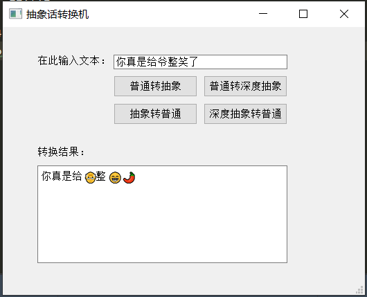

# nmsl 抽象话转换

> 基于Transformer的抽象话翻译机

普通文本转抽象话，抽象话转普通文本。支持深度抽象模式。

交互模式下，控制台需要支持emoji显示，不然会显示为乱码。

---
## 环境需要
```
python3.6
```
## 安装依赖库：
```
pip install -r requirements.txt
```
## 运行 - 命令行形式
```python main.py -m s2e```

### 参数列表

参数|格式|含义
-|-|-
-m |str| 指定转换模式。```s2e```：普通转抽象（默认），```s2edeep```：普通转深度抽象，```e2s```：抽象转普通，```e2sdeep```：深度抽象转普通。
-i |str| 输入文件路径，为空时采用交互模式。
-o |str| 输出文件路径，当指定输入文件路径时，必须指定输出路径。

## 运行 - GUI界面
```
python gui.py
```
初次加载需要稍微等待

## 界面示例：

